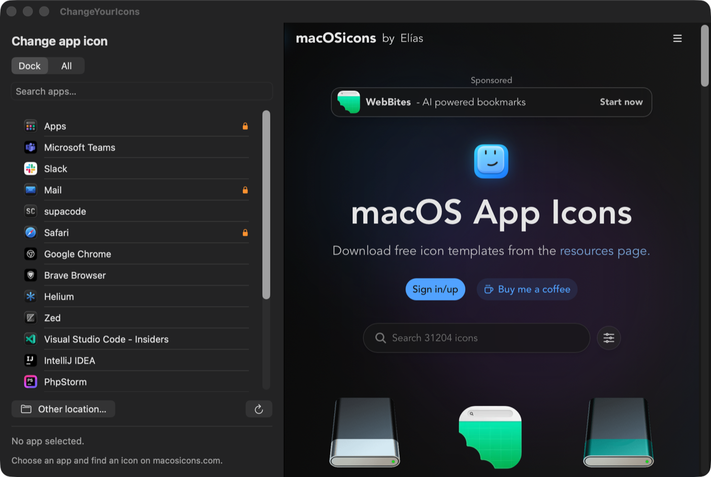

# ChangeYourIcons

A native macOS app (Swift + SwiftUI, macOS 14+) for changing the icon of any installed application, using icons from [macosicons.com](https://macosicons.com).

Instead of relying on the macosicons API, the app embeds the real website in a `WKWebView`, so you browse and download icons exactly as you would in a browser. When you download an `.icns`, it's applied to the app you've selected and the Dock is refreshed automatically.



## Features

- **Pick any app** — choose from a list of the apps in your **Dock**, from **all** installed applications, or browse to any other location.
- **Search** installed apps by name.
- **Browse macosicons.com** in an embedded web view and download an icon like a normal web user (no API key required).
- **Apply & restore** — apply a downloaded icon or revert an app to its original icon; the Dock is restarted so the change shows immediately.
- Apps protected by SIP (under `/System/Applications`) are flagged and skipped.

## Build & run

There is no test suite. On Apple Silicon the app must be ad-hoc signed after building, otherwise it won't launch.

```bash
# Build
xcodebuild -project ChangeYourIcons.xcodeproj -scheme ChangeYourIcons \
  -configuration Debug -derivedDataPath build \
  CODE_SIGN_IDENTITY="-" CODE_SIGNING_REQUIRED=NO CODE_SIGNING_ALLOWED=NO build

# Ad-hoc sign with entitlements
codesign --force --deep --sign - \
  --entitlements ChangeYourIcons/ChangeYourIcons.entitlements \
  build/Build/Products/Debug/ChangeYourIcons.app

# Run
open build/Build/Products/Debug/ChangeYourIcons.app
```

## Permissions

Changing the icon of an app in `/Applications` requires the **App Management** permission (macOS 13+). If applying an icon fails, grant ChangeYourIcons access under **System Settings → Privacy & Security → App Management**, then try again. The app is not sandboxed, since the sandbox forbids modifying other apps' bundles; for that reason it is distributed outside the App Store.
